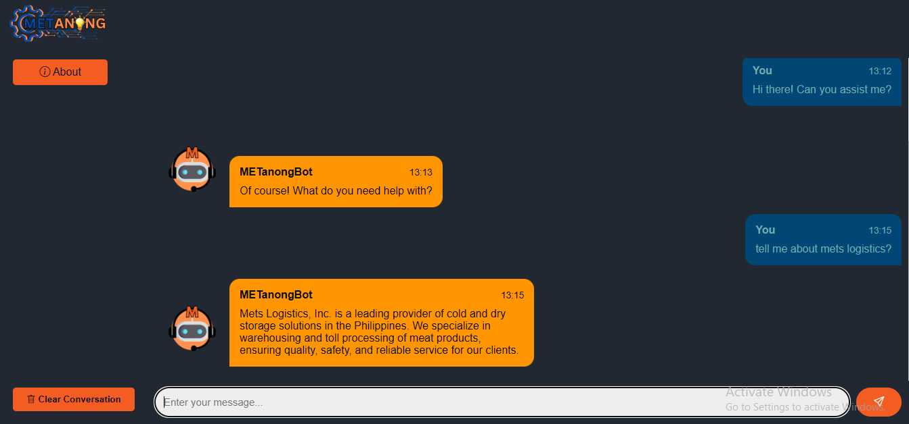

Project Description: Chatbot for Mets Logistics Inc

Overview:
Mets Logistics Inc aims to streamline customer interaction and enhance user experience through the implementation of a custom chatbot. This chatbot will serve as an interactive interface for addressing user queries related specifically to Mets Logistics services, operations, and inquiries. By leveraging natural language processing (NLP) and machine learning algorithms, the chatbot will understand user intent, provide accurate responses, and efficiently handle various customer interactions.

Key Objectives:

1. Improved Customer Service: Enhance customer satisfaction by providing timely and accurate responses to user inquiries.
2. Efficient Information Retrieval: Enable users to quickly access relevant information about Mets Logistics services, processes, and policies.
3. 24/7 Availability: Offer round-the-clock support to address user queries and concerns, improving accessibility and responsiveness.
4. Reduced Workload: Alleviate the burden on customer support teams by automating routine inquiries and tasks.
5. Data-driven Insights: Gather valuable insights into user preferences, frequently asked questions, and areas for service improvement through chatbot interactions.

Features:

1. Natural Language Understanding (NLU): Implement NLP algorithms to analyze user messages, understand intent, and extract relevant information.
2. Query Resolution: Provide accurate responses to user queries regarding Mets Logistics services, shipment tracking, pricing, and other related topics.
3. Multi-channel Integration: Deploy the chatbot across various communication channels, including website chat widgets, messaging platforms, and mobile apps.
4. Personalization: Tailor responses based on user preferences, historical interactions, and contextual information to enhance user engagement.
5. Fallback Mechanism: Implement a fallback mechanism to handle user queries that fall outside the chatbot's scope or require human intervention.
6. Integration with Knowledge Base: Integrate the chatbot with Mets Logistics' knowledge base to access up-to-date information and resources.
7. Feedback Mechanism: Collect user feedback to continuously improve the chatbot's performance, accuracy, and user satisfaction.

Implementation Approach:

1. Requirement Analysis: Collaborate with Mets Logistics stakeholders to understand business requirements, user expectations, and key use cases for the chatbot.
2. Chatbot Design: Design conversational flows, user interfaces, and integration points based on identified requirements and user personas.
3. Development: Develop the chatbot using a suitable platform or framework, integrating NLP libraries, machine learning models, and APIs as needed.
4. Testing and Validation: Conduct rigorous testing to ensure the chatbot's functionality, accuracy, and performance across different scenarios and user inputs.
5. Deployment: Deploy the chatbot on Mets Logistics' chosen platforms, ensuring seamless integration and optimal performance in production environments.
6. Monitoring and Maintenance: Monitor chatbot interactions, analyze performance metrics, and iterate on the design to address user feedback and improve functionality over time.

Project Deliverables:

1. Functional Chatbot Prototype
2. User Documentation and Training Materials
3. Deployment Plan and Execution
4. Performance Metrics and Analytics Dashboard
5. Ongoing Support and Maintenance Services

## Photo
